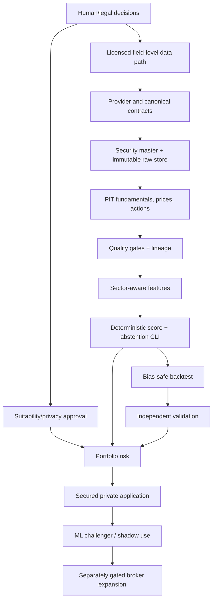

# Dependency Graph

Work may proceed in parallel only when contracts are stable and files do not overlap. Licensing blocks real ingestion; suitability blocks personalized actions; independent validation blocks backtest claims; security/privacy review blocks personal data and external AI.
